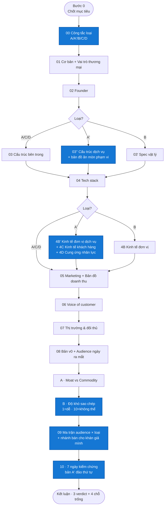

<div align="center">
  
  <br/>
  <h1>govrl-research-creator-product</h1>
  <p><em>Công tắc loại · 5 nhánh · nhánh dịch vụ có 3 dạng con · action 7 ngày</em></p>
</div>

---

## Bức tranh tổng



**NEW v0.0.6 (highlight xanh):** A' chính thức + 3 dạng con · 03'' · 4B' · 4C · 4D · Lớp 09 ma trận · Lớp 10 A' đảo thứ tự · R7-R9.

---

# LỚP 00 · CÔNG TẮC LOẠI SẢN PHẨM (v0.0.6 CHÍNH THỨC)

| Loại | Định nghĩa | Ví dụ |
|---|---|---|
| **A** Ứng dụng / SaaS | Khách trả tiền cho quyền dùng phần mềm | Nexlev · 1of10 · vidIQ |
| **A'** Dịch vụ / Agency | **Khách trả tiền cho kết quả do người làm ra** | Replayed |
| **B** Sản phẩm vật lý | Khách nhận một vật | Sách in · merch · thực phẩm bổ sung |
| **C** Số / khoá học | Khách nhận tệp hoặc quyền truy cập nội dung | PTYA · ebook |
| **D** Cộng đồng | Khách trả tiền cho quyền tham gia | Skool group · Discord trả phí |

### Phân dạng con của A' (BẮT BUỘC chọn 1)

| Dạng | Cách tính tiền | Rủi ro chính |
|---|---|---|
| **A'-1 Dịch vụ đóng gói** | Theo đơn vị giao (per-video, per-bài, per-thiết kế) | Khách mua một lần rồi biến mất |
| **A'-2 Thuê bao** | Theo tháng, có hạn mức | Vượt hạn mức ăn mòn biên |
| **A'-3 Sàn ghép nối** | Ăn hoa hồng, không tự làm | Hai bên gặp nhau xong bỏ sàn |

Dạng con quyết định Lớp 4C soi cái gì. **Replayed = A'-1.**

**Sản phẩm lai** → chọn loại theo hình thái sản phẩm chính người mua nhận được, ghi header `Loại: X + Y`.

---

## Nguyên tắc chung (giữ từ v0.0.2-v0.0.5)

### Ngôn ngữ đầu ra (SỬA v0.0.9.3)
Ngôn ngữ report do **hệ thống truyền vào** (theo ngôn ngữ người dùng đang chọn trên ứng dụng),
mặc định tiếng Việt. Mọi ví dụ tiếng Việt trong skill này là **minh hoạ cách viết**, không phải
quy định ngôn ngữ — gặp yêu cầu ngôn ngữ khác thì dịch toàn bộ nhãn, tiêu đề lớp, chú thích, footer.

Viết như người bản ngữ của ngôn ngữ đó, không dịch máy. Riêng bảng dịch thuật ngữ dưới đây áp dụng
khi đầu ra là tiếng Việt:

Cấm jargon không giải thích. Bảng dịch: pivot → đổi hướng · moat → rào cản · CAC → tiền quảng cáo lấy 1 khách · faceless → không lộ mặt · scale → mở rộng · pain point → vấn đề khách chửi · audience → người theo dõi · retainer → thuê bao tháng · churn → tỉ lệ rời bỏ · MRR → doanh thu định kỳ hàng tháng · LTV → giá trị vòng đời khách · POD → in theo đơn · MOQ → số lượng tối thiểu · unit economics → kinh tế đơn vị.

### Trung lập
Cấm bias personal product. Không "cho govrl.io", "bạn ở VN lợi thế sân nhà".

### Hình ảnh + logo
Google Favicons `?sz=256`, screenshot 16:9 crop top, logo tint `rgba(255,255,255,.06)`.

### Style Inter dark theme
`--bg: #0f0f0f · --ink: #f1f1f1 · --neutral-border: #3a3a3a`. Điểm nhấn chỉ cho ✗ đỏ · ✓ xanh · score bar.

---

# BỘ LỚP CHO A' (Dịch vụ / Agency) — NEW v0.0.6

| Lớp | Nội dung |
|---|---|
| 01 | Cơ bản + Vai trò thương mại (giữ v0.0.5) |
| **03''** | Cấu trúc dịch vụ + **Bản đồ ăn mòn phạm vi** |
| 04 | Tech stack giao việc (giữ) |
| **4B'** | **Kinh tế đơn vị dịch vụ — BẮT BUỘC (R8)** |
| **4C** | **Kinh tế khách hàng — BẮT BUỘC với A'-1 và A'-3** |
| **4D** | **Cung ứng nhân lực** |
| 05 | Marketing + Bản đồ doanh thu (giữ) |
| 06, 07, 08 | Giữ |
| 09 | **Ma trận audience × loại sản phẩm** (thay cây quyết định cũ) |
| 10 | **7 ngày bản dịch vụ — đảo thứ tự** (D4 tự tay làm trước, tuyển sau) |

---

## Lớp 4B' — Kinh tế đơn vị DỊCH VỤ (BẮT BUỘC · R8)

> **Lớp này KHÔNG được tắt.** Xem R8.

### Vì sao
Sách bán xong là hết. Dịch vụ thì mỗi đơn hàng đều phải trả tiền cho người làm. Ở loại A', kinh tế đơn vị **chính là** mô hình kinh doanh, không phải phụ lục.

Report Replayed v0.0.5 ghi "% biên gross chỉ có ước tính 30-50%, không dám in số cụ thể" rồi bỏ trống — **sai luật**. Dữ liệu để tính nằm ngay trong chính report đó.

### Bước 1 — Định nghĩa đơn vị giao
Một câu, cụ thể đến mức đặt hàng được. VD: *"1 video hoàn chỉnh 16-35 phút raw, đã có nhạc bản quyền và motion graphics cơ bản, chưa gồm thumbnail."*

Đơn vị sai → cả bảng sai. Nhiều đơn vị khác nhau → 1 cột cho mỗi đơn vị.

### Bước 2 — Bảng bắt buộc

| Dòng | Ghi chú |
|---|---|
| Giá bán mỗi đơn vị | Theo bảng giá công khai |
| **Giờ công mỗi đơn vị** | Tách theo vai trò: người làm chính / kiểm duyệt / hỗ trợ khách |
| Đơn giá nhân công mỗi giờ | Theo thị trường lao động thực tế của pool |
| Chi phí nhân công mỗi đơn vị | Giờ × đơn giá, cộng các vai trò |
| Chi phí sửa lại | Hạn mức sửa miễn phí × đơn giá — **chi phí ẩn lớn nhất** |
| Phần mềm, kho lưu trữ phân bổ | Chia đều theo số đơn vị/tháng |
| Phí thanh toán, phí sàn | |
| **Lợi nhuận gộp mỗi đơn vị** | In đậm |
| **Biên gộp %** | In đậm |
| Chi phí cố định hàng tháng | Người quản lý, công cụ, marketing |
| **Điểm hoà vốn** | Số đơn vị/tháng = chi phí cố định ÷ lợi nhuận mỗi đơn vị |

### Bước 3 — Trần quy mô (BẮT BUỘC 3 dòng)
- Số đơn vị **một người** làm được mỗi tháng
- Số đơn vị **chủ doanh nghiệp làm một mình** trước khi buộc phải tuyển
- Doanh thu trần khi làm một mình = hai số trên × giá bán

Bán dịch vụ = bán thời gian. Phải biết trần ở đâu trước khi bắt đầu.

### Bước 4 — Vốn lưu động
Trả người làm trước hay sau khi khách trả? Chênh bao nhiêu ngày? Với dịch vụ, đây là lý do phổ biến nhất khiến doanh nghiệp có lãi vẫn chết vì hết tiền mặt.

### Kiểm tra tam giác (BẮT BUỘC)
Ba số phải khớp: **giá bán · giờ công · đơn giá nhân công**.

Nếu `giờ công × đơn giá` vượt **60% giá bán** → in cảnh báo:
> *"Biên mỏng bất thường. Hoặc số giờ công ước lượng sai, hoặc mô hình này phụ thuộc lao động giá rẻ hơn mức đang giả định."*

**Ví dụ đáng lẽ phải xuất hiện trong report Replayed:** giá $349/video, rate biên tập viên $15-25/giờ, video 20 phút raw thường tốn 8-12h → chi phí $120-300 / doanh thu $349. Tỷ lệ 34-86%. Đầu dải xấu thì gần như không còn gì. Con số này đủ sức lật ngược kết luận.

### Quy tắc dữ liệu
- Thiếu số thật → **vẫn render bảng**, gắn tag `ước lượng` toàn bảng, in danh sách giả định bên dưới. **Cấm bỏ trống.**
- Nguồn tra đơn giá nhân công: tin tuyển dụng chính đối tượng nghiên cứu trên sàn việc làm → bảng lương ngành → giá chào trên sàn freelance. Ghi rõ nguồn + ngày.
- Giờ công/đơn vị: tra từ mô tả công việc, chia sẻ người trong nghề, hoặc ước lượng theo độ phức tạp.

---

## Lớp 4C — Kinh tế khách hàng (BẮT BUỘC A'-1 và A'-3)

Với A'-2 thuê bao → gộp vào phần thuê bao.

### Vì sao
Bán theo đơn vị, không thuê bao, nghĩa là mỗi tháng phải đi tìm khách lại từ đầu. Với mô hình này, **tỷ lệ mua lại là chỉ số sống còn**, quan trọng hơn cả biên lợi nhuận. Report Replayed không có một dòng nào về nó dù đối tượng bán per-video thuần.

### Trường bắt buộc

| Trường | Cách tra |
|---|---|
| Có mua lại không, tỷ lệ bao nhiêu | Review nhắc "đơn thứ n", testimonial nhắc thời gian gắn bó, khách xuất hiện lặp trên trang giới thiệu |
| Số đơn vị trung bình mỗi khách mỗi tháng | |
| Vòng đời khách | Bao nhiêu tháng trước khi ngừng |
| **Giá trị vòng đời thô** | Đơn vị/tháng × lợi nhuận mỗi đơn vị × số tháng |
| Tỷ trọng doanh thu từ khách cũ | Nếu suy được |
| Chi phí có một khách mới | Nếu có dấu vết quảng cáo, hoa hồng giới thiệu |
| Cơ chế giữ chân | Có gì buộc khách quay lại ngoài chất lượng |

### Quy tắc render
- Không tra được dữ liệu mua lại ở mô hình A'-1 → **BẮT BUỘC in cảnh báo**:
> *"Mô hình bán theo đơn vị mà không rõ tỷ lệ mua lại. Đây là rủi ro lớn nhất của mô hình này: nếu khách chỉ mua một lần, toàn bộ chi phí tìm khách phải hoàn vốn trong đúng một đơn hàng."*
- Nếu lợi nhuận một đơn hàng **nhỏ hơn** chi phí ước tính để có một khách → in cảnh báo đỏ: *"Mô hình không tự nuôi được."*

---

## Lớp 03'' — Cấu trúc dịch vụ + Bản đồ ăn mòn phạm vi

Giữ bảng gói và quy trình như v0.0.5. Thêm 2 phần.

### Phần A — Cam kết và phạm vi

| Trường | Ghi chú |
|---|---|
| Thời gian giao cam kết | Có công bố cứng không, hay chỉ nói chung chung |
| Hình phạt khi trễ | Hoàn tiền, giảm giá, hay không có gì |
| Hạn mức sửa lại | Số lần hoặc số giờ, sau đó tính phí bao nhiêu |
| Ai kiểm tra chất lượng trước khi giao | Người làm tự kiểm, có người duyệt, hay khách tự phát hiện |
| Kênh liên lạc với khách | |
| Điều **không** bao gồm | Danh sách rõ |

### Phần B — Bản đồ ăn mòn phạm vi (NEW)

Liệt kê các chỗ biên lợi nhuận bị ăn mòn âm thầm:

- Sửa lại vượt hạn mức
- Khách gửi tư liệu sai chuẩn, phải xử lý thêm
- Trao đổi qua lại, họp, giải thích
- Việc phát sinh không tính phí để giữ khách
- Làm lại vì người làm mới chưa quen phong cách

Mỗi dòng: có/không, dựa vào bằng chứng nào ở Lớp 06.

**Ví dụ Replayed:** cụm chê *"hạn mức sửa 1 giờ quá hẹp"* và *"chất lượng không đều giữa các editor"* là bằng chứng trực tiếp cho 2 dòng đầu → biên thực tế thấp hơn biên trên giấy.

---

## Lớp 4D — Cung ứng nhân lực

Với dịch vụ, nguồn người làm là chuỗi cung ứng. Thiếu lớp này thì không đánh giá được năng lực thật.

| # | Trường |
|---|---|
| 1 | Quy mô đội ngũ làm việc thực tế — nếu không public thì ghi rõ và nêu vì sao quan trọng |
| 2 | Nguồn tuyển: sàn nào, quốc gia nào |
| 3 | Đơn giá trả cho người làm |
| 4 | Cách sàng lọc, tỷ lệ nhận |
| 5 | Thời gian đào tạo trước khi nhận việc thật |
| 6 | Toàn thời gian, bán thời gian hay theo việc |
| 7 | Cơ chế giữ người làm |
| 8 | **Rủi ro người làm mang khách đi** — có ràng buộc gì không |
| 9 | Ai gánh chi phí khi giao hàng lỗi |

### Quy tắc
- **Mục 1 là chỉ số quan trọng nhất của loại A'** — quyết định năng lực giao hàng thật. Không truy được → đưa vào "chỗ trống dữ liệu" cuối report, **không được bỏ qua im lặng**.
- Mục 8 là rủi ro đặc thù của **A'-3 sàn ghép nối**: khi bên cung và bên cầu gặp nhau xong, họ có lý do gì để tiếp tục đi qua nền tảng?

---

# LỚP 09 · MA TRẬN AUDIENCE × LOẠI SẢN PHẨM (SỬA từ cây quyết định cũ)

### Lỗi đang gặp (từ report Replayed v0.0.5)
- Chia 5 nhánh theo **định vị chiến lược** (rẻ hơn, cao cấp hơn, sàn), KHÔNG theo mức audience như spec v0.0.4 quy định
- Câu chốt *"chưa có audience thì đừng làm"* bê nguyên từ nhánh SaaS sang. **Với dịch vụ, câu đó SAI.**
- Bằng chứng nằm ngay trong report: Ali Korsan xây được đội 11-50 người mà không có kênh nào. **Dịch vụ là loại sản phẩm duy nhất không cần audience trước — chỉ cần kỹ năng và 10 cuộc gọi.**

### Cách sửa — ma trận 2 trục

Lớp 09 render **ma trận**: trục dọc = mức audience người đọc, trục ngang = loại sản phẩm.

| Audience người đọc | A. SaaS | A'. Dịch vụ | B. Vật lý | C. Số/khoá học |
|---|---|---|---|---|
| **0-1K** | Không | **Được ngay** — rào cản là kỹ năng, không phải audience | Không | Không |
| **1K-10K** | Không | Được | Hạn chế | Được |
| **10K-50K** | Tool hẹp 1 tính năng | Được, có thể nâng giá nhờ uy tín | Được | Được |
| **>50K** | Được | Được | Được | Được |

### Quy tắc bắt buộc
- **Rào cản thật của mỗi loại phải ghi rõ**, không mặc định audience:
  - SaaS → audience và vốn phát triển
  - **Dịch vụ → kỹ năng và năng lực giao hàng**
  - Vật lý → vốn và tồn kho
  - Số/khoá học → audience và uy tín
- Ô "Không xây gì cả" trong khối kết luận **phải viết lại theo loại sản phẩm**. Cấm dùng chung 1 câu.
  - Với A': *"Chưa từng tự tay làm ra sản phẩm này ở mức khách chịu trả tiền thì đừng bán dịch vụ — rào cản là tay nghề, không phải người theo dõi."*
- Mỗi ô vẫn giữ **"KHÔNG nên làm"** theo spec v0.0.4.
- Ngoài ma trận, giữ phần định vị chiến lược (rẻ hơn / cao cấp hơn / sàn) — nhưng đặt **sau** ma trận và gọi đúng tên: **bản đồ định vị**, không phải cây quyết định.

### Nhánh mới BẮT BUỘC MỌI LOẠI — "Bán cho chính khán giả của mình"

> **Bán cho chính khán giả của mình.** Không đi cạnh tranh với đối tượng nghiên cứu, mà lấy mô hình của họ áp vào tệp khán giả sẵn có. Với dịch vụ: nhận làm cho người xem kênh mình. Ưu điểm: không tốn chi phí tìm khách, giá bán được cao hơn nhờ quen mặt. Nhược điểm: trần quy mô thấp, và bận làm dịch vụ thì không còn thời gian làm nội dung — chính cái nuôi nguồn khách.

Bắt buộc xuất hiện ở mọi loại, không riêng A'.

---

# LỚP 10 · 7 NGÀY KIỂM CHỨNG — BẢN A' ĐẢO THỨ TỰ

### Lỗi đang gặp
Ở report Replayed, D5 tuyển 3 người làm và chạy việc thử — tức tiêu tiền và tiêu công sức người khác — **trong khi chưa ai trả tiền**. Đúng thứ tự phải là: xác nhận có người trả tiền trước, dựng năng lực sau.

Quy tắc kill ghi *"không được nhảy vào code/dev"* — nhánh dịch vụ **không có phần dev nào để nhảy vào**. Câu bị copy từ mẫu SaaS.

### Khung 7 ngày cho A'

| Ngày | Việc | Pass khi |
|---|---|---|
| D1 | Đọc toàn bộ đánh giá xấu của đối tượng nghiên cứu (Lớp 06), xếp thành 3 cụm. Mỗi cụm viết một câu: trong dịch vụ của tôi thì giải thế nào | 3 cụm + 3 cách giải |
| D2 | Gọi 5 khách hàng tiềm năng đúng ngách. Đối chiếu với 3 cụm ở D1 | ≥3/5 tự nhắc đúng cụm đó |
| D3 | Dựng bảng kinh tế đơn vị **cho chính mình**: giá dự kiến, giờ công tự làm, biên còn lại. Đối chiếu bảng Lớp 4B' | Biên >40% và tự tay làm nổi |
| D4 | **Tự tay làm một đơn vị hoàn chỉnh miễn phí** cho một người ở D2. Bấm giờ thật | Giao được, số giờ không vượt ước lượng D3 quá 50% |
| D5 | Đưa giá cho chính người đó và 4 người còn lại. Yêu cầu trả trước một phần | **≥1 người trả tiền thật** |
| D6 | **Chỉ khi D5 đạt:** tìm 3 người làm thuê, gửi việc thử có trả phí | 3 người giao đúng hạn |
| D7 | Quyết định | Xem quy tắc kill |

### Quy tắc kill bản dịch vụ
> Nếu D4 cho thấy số giờ thực tế cao hơn ước lượng quá 50%, **hoặc** D5 không ai trả tiền → **dừng**. Biên đã âm ngay từ khi tự làm thì thuê người chỉ khiến lỗ nhanh hơn. Đổi ngách hoặc đổi định vị giá rồi chạy lại.

**Điểm khác cốt lõi so với bản SaaS:** D4 BẮT BUỘC tự tay làm. Với dịch vụ, người sáng lập không tự làm được một đơn vị đạt chuẩn thì không kiểm soát được chất lượng, không định giá đúng, và không đào tạo được ai.

---

# BỘ LỚP CHO B (Vật lý) — GIỮ từ v0.0.5

- Lớp 01 + Vai trò thương mại
- Lớp 03' Spec vật lý (số trang · khổ · cỡ chữ · trọng lượng)
- Lớp 04' Sản xuất & chuỗi cung ứng (POD vs In số lượng)
- Lớp 4B Kinh tế đơn vị vật lý
- Lớp 05 + Bản đồ doanh thu thật
- Lớp 08 + Audience ngày ra mắt
- Phụ lục P Pháp lý (12 mục · FTC bắt buộc cho sản phẩm dạy kiếm tiền)

Chi tiết: giữ nguyên spec v0.0.5.

---

# BỘ LỚP CHO A / C / D — GIỮ từ v0.0.4

Bộ mặc định 10 lớp:
- Lớp 08 Bản v0 (7 trường bắt buộc, quan trọng nhất là "100 khách đầu tiên đến từ đâu")
- Lớp 09 (SỬA v0.0.6: ma trận thay cây quyết định)
- Lớp 10 7 ngày kiểm chứng (v0.0.4 cho A/C/D · v0.0.6 A' đảo thứ tự)

Với **D (Cộng đồng)**: thay Lớp 03 bằng "Cấu trúc sinh hoạt" (kênh · event cadence · engagement mechanics).

---

# ĐÁNH GIÁ B — ĐỘ KHÓ SAO CHÉP (v0.0.9 · ĐẢO LẠI CHIỀU)

### KHOÁ THANG ĐIỂM
- Tên chỉ số: **Độ khó sao chép**
- **Thang: 10 = DỄ COPY 1-2 tuần · 1 = KHÔNG THỂ copy** (giảm dần)
- Nhãn mức: **7-10 Dễ · 4-6 Trung bình · 2-3 Khó · 1 Không thể**

### Quy ước visual — MÀU KHỚP TRỰC GIÁC (v0.0.9.1)
- **Số CÀNG TO → bar CÀNG DÀI.** Score 10 = bar 100%. Score 1 = bar 10%.
- Gradient bar: **đỏ (trái, khó copy) → vàng → XANH LÁ (phải, dễ copy)**
- Bar dài + đầu **XANH LÁ** = DỄ copy (an toàn cho người mua, cảnh báo cho founder)
- Bar ngắn + đầu **ĐỎ** = KHÓ copy (moat mạnh)

### Màu label pill (bắt buộc)
| Score | Label | Màu text | Ý nghĩa |
|---|---|---|---|
| 7-10 | **DỄ** | **Xanh lá** `#a8e6c1` | Sign "safe" — copy được trong tuần/tháng |
| 4-6 | **TRUNG BÌNH** | **Vàng** `#f4c97a` | Sign "caution" — 6-12 tháng |
| 2-3 | **KHÓ** | **Đỏ** `#f2a89a` | Sign "warning" — 1-2 năm cày |
| 1 | **KHÔNG THỂ** | **Xanh dương** `#7FD8FF` | Sign "unique" — founder cá nhân, không outsource được |

Quy ước: Dễ = xanh (giống ✓ trong UI), Khó = đỏ (giống ⚠️). Bar tip màu = label pill màu.

### Implementation bắt buộc — CSS custom property `--s:N`
```html
<div class="score-bar" style="--s:10">
  <div class="score-track"><div class="score-fill"></div></div>
  <span class="score-num">10</span>
</div>
```
```css
.score-bar{display:grid;grid-template-columns:1fr 26px;align-items:center;gap:12px;min-width:200px}
.score-track{position:relative;height:10px;background:rgba(255,255,255,.05);border-radius:5px;overflow:hidden}
.score-track::before{content:"";position:absolute;inset:0;background:linear-gradient(90deg,#ef4444,#f0b04a,#17b26a);opacity:.22}
.score-fill{position:absolute;top:0;left:0;bottom:0;width:calc(var(--s,1) * 10%);background:linear-gradient(90deg,#ef4444,#ef4444 20%,#f0b04a 45%,#a8c93a 70%,#17b26a 100%);background-size:calc(1000% / var(--s,1)) 100%;border-radius:5px}
```
CẤM ghi `width:X%` cứng — chỉ khai báo `--s:N`.

### Reorder bảng: từ điểm 10 (dễ nhất) xuống 1 (không thể)
Người đọc thấy commodity trước, moat sâu nhất cuối cùng — nhấn mạnh phần cứng thuộc về founder cá nhân.

### Cách nhớ
"Số 10 là **hàng chợ** — copy 1-2 tuần. Số 1 là **thành trì** — chỉ founder cá nhân có."

- **Chỉ in một dạng phần trăm.** Không in cùng lúc `52/140 = 37%` và `63% dễ`.

- **Chỉ in một dạng phần trăm.** Không in cùng lúc `52/140 = 37%` và `63% dễ`. Chọn một, ghi rõ nghĩa.

14 yếu tố chuẩn (xếp từ dễ sao chép → khó sao chép):
Pricing model · Business model structure · Landing page · Templates · Tech stack · Content library · Coaching model · Curriculum · Community & alumni · Reviews reputation · Domain expertise · Media proof · Audience/distribution · Personal brand founder.

Score summary 4 KPI: Tổng điểm · % độ khó trung bình · Yếu tố Khó (7+) · Không thể clone (10).

---

# PHỄU (BẢN ĐỒ DOANH THU) — PHẢI DÙNG BOWL-SVG (v0.0.9 CHUẨN)

Mọi phễu trong Lớp 05/06 (customer journey, revenue map, funnel bán hàng) **BẮT BUỘC** vẽ dưới dạng **bowl 3D**: mỗi tầng là một cái bát thon dần xuống dưới, số to nằm giữa bát, mô tả bên phải. CẤM dùng rectangle stack cũ.

### Palette 5 tầng chuẩn
| Tầng | Fill gradient | Ellipse tối |
|---|---|---|
| 01 | `#eb7168 → #b83f39` (đỏ san hô) | `#8f2f2b` |
| 02 | `#efb352 → #b5771f` (hổ phách) | `#85561a` |
| 03 | `#c7c848 → #8a8b28` (ô liu) | `#5f6019` |
| 04 | `#4bc0b7 → #207e78` (teal) | `#155753` |
| 05 | `#7aa9d9 → #385e8a` (xanh dương) | `#243f5e` |

### Width tầng (thu hẹp dần)
100% → 84% → 68% → 52% → 38%

### Template SVG per tầng
```svg
<svg viewBox="0 0 400 100" preserveAspectRatio="none">
  <defs><linearGradient id="bwN" x1="0" y1="0" x2="0" y2="1">
    <stop offset="0" stop-color="LIGHT"/><stop offset="1" stop-color="DARK"/>
  </linearGradient></defs>
  <path d="M 10 20 L 390 20 L 358 82 Q 200 100 42 82 Z" fill="url(#bwN)"/>
  <ellipse cx="200" cy="20" rx="190" ry="14" fill="SHADOW"/>
  <ellipse cx="200" cy="20" rx="186" ry="10" fill="url(#bwN)"/>
  <ellipse cx="200" cy="17" rx="176" ry="4" fill="rgba(255,255,255,.28)"/>
</svg>
```
- `path` = thân bát: trapezoid với đáy cong Q (curve xuống)
- `ellipse cy=20 ry=14` (tối) = viền rim bát
- `ellipse cy=20 ry=10` (fill) = miệng bát
- `ellipse cy=17 ry=4` (trắng .28) = highlight bóng loáng

### HTML skeleton
```html
<div class="funnel-viz">
  <div class="funnel-row">
    <div class="funnel-slot">
      <div class="funnel-bowl" style="width:100%">
        <svg …>…</svg>
        <div class="fn-num">01</div>
      </div>
    </div>
    <div class="funnel-info">
      <h5 class="fn-h5-r1">Tên tầng · phân đoạn</h5>
      <div class="fn-sub">Sub-title chỉ số quan trọng</div>
      <p>Mô tả ngắn 1-2 dòng</p>
      <div class="fn-metric"><span class="m-val">$XXX</span><span class="m-lbl">Nhãn</span></div>
    </div>
  </div>
  <!-- 4 rows kế tiếp -->
</div>
```

Tầng "Chặng ra tiền chính" (thường là tầng 3) thêm `<span class="fn-badge">Chặng ra tiền chính</span>` phía trên h5.

---

# LONG-TEXT PATTERN — TÁCH RA CARD (v0.0.9)

**Nguyên tắc:** Bảng chỉ chứa số ngắn hoặc string < 40 ký tự. Mọi ô có giải thích dài (câu, đoạn) **bắt buộc** tách ra thành 1 trong 3 component:

### 1. `.split-cards` — 2 con số đối chiếu
Dùng khi so sánh 2 giả định / 2 nguồn số / 2 kịch bản.
```html
<div class="split-cards">
  <div class="split-card">
    <div class="sc-label"><span class="sc-dot"></span>Label 1</div>
    <div class="sc-val">$XXX</div>
    <div class="sc-sub">Ghi chú ngắn</div>
  </div>
  <div class="split-card hero-g">…</div>
</div>
```
Variants: `.hero-y` (vàng nhấn), `.hero-g` (xanh nhấn), `.hero-b` (xanh dương).

### 2. `.explain-card` — giải thích 1 câu / 1 đoạn
Dùng cho câu "vì sao chênh X lần", "khoảng chênh Y đủ để...", các lời cảnh báo giải nghĩa.
```html
<div class="explain-card">
  <div class="ec-title">Tiêu đề ngắn</div>
  <p>Giải thích đầy đủ. <b>Bold ý chính.</b></p>
</div>
```
Variant `.blue` cho nội dung neutral thay vì cảnh báo.

### 3. `.time-breakdown` + `.tb-total` — bóc tách thời gian / cost / công sức
Dùng khi cộng nhiều thành phần thành tổng.
```html
<div class="time-breakdown">
  <div class="tb-item"><div class="tb-label">…</div><div class="tb-val">…</div></div>
  <div class="tb-item"><div class="tb-label">…</div><div class="tb-val">…</div></div>
  <div class="tb-item"><div class="tb-label">…</div><div class="tb-val">…</div></div>
</div>
<div class="tb-total">
  <div class="tb-label">Tổng</div>
  <div class="tb-val">~10-15 giờ/tuần</div>
</div>
```

### Cấm
- Bảng có ô text dài > 40 ký tự — tách ra card.
- Cell nội dung dài ép người đọc quét mắt trái-phải — chia dọc thành card.

---

# QUY TẮC DỮ LIỆU R1-R9

### R1 · Biểu đồ phân biệt data thật vs suy đoán (v0.0.4)
Nét đứt + opacity .35 cho vùng ước lượng. Mốc sự kiện chỉ vẽ khi confirmed, inference thêm `?`.

### R2 · % mẫu nhỏ kèm (x/n) (v0.0.4)
`n<100` → `19% (11/59)`.

### R3 · Số unverified không lên KPI hero (v0.0.4)
4 ô KPI chỉ nhận confirmed. Không đủ 4 → in 3 ô, không độn.

### R4 · Tách "đơn vị bán ra" khỏi "đơn vị giao đi" (v0.0.5)
Bán lẻ trả tiền / bản miễn phí / đặt trước / bán theo gói. Không tách → tag `chưa tách`, không lên KPI hero.

### R5 · Kiểm tra chéo số học giữa các KPI (v0.0.5)
2 số cùng loại lệch >5× không giải thích → cảnh báo. VD: cuốn 1 bán 300K/5 năm vs cuốn 3 bán 2.97M/1 ngày (chênh 10× trong 24h — gần chắc gộp cả free/pre-order).

### R6 · Mọi con số tiền kèm ngày và nguồn (v0.0.5)
`$20.41 · tra ngày 2026-09-01 · Amazon`. Không có ngày → không in.

### R7 · Khoá thang điểm + khoá visual (v0.0.9 · ĐẢO CUỐI)
Bảng "Độ khó sao chép": **10 = DỄ COPY 1-2 tuần · 1 = KHÔNG THỂ copy** (giảm dần).

**Ràng buộc visual (bắt buộc):**
- Bar length = score × 10%. Số to → bar dài. Số và bar luôn đồng biến.
- Gradient ĐẢO: xanh (trái) → vàng → đỏ (phải). Bar ngắn = xanh = moat mạnh. Bar dài = đỏ = commodity.
- Implementation: `style="--s:N"` + `width:calc(var(--s) * 10%)`. Cấm ghi width cứng.

**Reorder table:** dòng đầu = điểm 10 (dễ nhất, commodity) → dòng cuối = điểm 1 (không thể, moat sâu nhất).

**Lịch sử đảo:** v0.0.6 (1=dễ) → v0.0.7 (1=không thể) → v0.0.8 (1=dễ, khoá visual) → **v0.0.9 (10=dễ, giữ khoá visual, đảo gradient)**. Lý do chốt v0.0.9: user muốn "dễ copy = số to" như thang khảo sát Likert quen thuộc; bar dài + đỏ = commodity warning trực quan hơn.

### R8 · Cấm tắt lớp kinh tế (NEW v0.0.6)
Lớp kinh tế đơn vị (4B cho vật lý, 4B' cho dịch vụ, tương đương cho các loại khác) **bắt buộc với mọi loại sản phẩm**. Lớp 00 không có quyền tắt.

Thiếu dữ liệu → render ở chế độ ước lượng kèm giả định. Một bảng ước lượng có ghi giả định vẫn hữu ích hơn ô trống, vì người đọc thay số của mình vào được.

### R9 · Bắt buộc ráp mảnh (NEW v0.0.6)
Nếu report đã có đủ dữ kiện để tính ra một con số quan trọng, skill **phải tính**, không được để rời rạc.

**Ví dụ bị bỏ lỡ:** report Replayed có giá bán $349 ở Lớp 01 và rate nhân công $15-25/giờ ở Lớp 10 — nhưng không nhân ra chi phí mỗi đơn vị, trong khi đó chính là con số quyết định.

**Cách làm:** trước khi xuất report, rà lại toàn bộ số đã thu thập, hỏi "hai số nào ghép lại ra được một chỉ số mà người đọc cần?" Ghép được thì thêm dòng tính, ghi rõ phép tính và giả định.

### R9b · Report viết cho người mua, không phải cho người đi cào (NEW v0.0.9.2)
CẤM viết việc cho người đọc: "cần cào lại landing", "cần đăng ký trial", "chạy BuiltWith đi".
Khâu thu thập là việc của hệ thống. Mục "Số bị từ chối in" chỉ ghi thứ ĐÃ thử mà không có,
kèm lý do (trang chặn, registry không công khai, nền tảng không cho xem).

### R10 · Không được bỏ sót dữ liệu đã thu thập (NEW v0.0.9.2)
Mọi trường KHÁC NULL trong dữ liệu đưa vào **phải xuất hiện ít nhất một lần** trong report.
Thu thập được mà không in ra là lỗi nặng hơn cả thiếu data — vì người đọc tưởng là không có.

**Lỗi thật (report Nexlev 2026-09-02):** dữ liệu vào có `traffic giảm 34,11% so tháng trước`,
`ngày ra mắt 2023-11`, `whois 2023-01-24` — report in mỗi chữ "2023", vứt cả ba.

**Cách làm:** trước khi xuất, duyệt từng khoá dữ liệu vào, đánh dấu đã dùng ở lớp nào.
Khoá nào không có chỗ đặt → cho vào bảng Lớp 01 hoặc Lớp 08, không im lặng bỏ.

### R11 · Mốc thời gian in đủ độ chính xác đang có (NEW v0.0.9.2)
Có ngày đầy đủ thì in `YYYY-MM-DD`, có tháng thì in `YYYY-MM`. **CẤM rút về mỗi năm.**
Mốc bắt buộc nếu tra được: ngày đăng ký domain (whois) · ngày ra mắt/công bố đầu tiên ·
ngày đổi giá hoặc đổi định vị · ngày của mỗi con số tiền và mỗi rating.
Mỗi mốc kèm nguồn: `<code>2023-01-24</code> · <span class="tag ok">whois</span>`.

**Lịch sử giá:** có bản lưu Wayback của trang giá thì BẮT BUỘC in dòng so sánh
`giá cũ (ngày) → giá nay (ngày)` ở Lớp 01 hoặc 4B, kèm link bản lưu. Đổi từ mua đứt sang
thuê bao, hay tăng giá 3 lần trong 2 năm, là tín hiệu mô hình quan trọng hơn cả giá hiện tại.

### R12 · Số xu hướng phải có chiều + kỳ so sánh (NEW v0.0.9.2)
`giảm 34,11% so với tháng trước (SimilarWeb, 2026-07)` — không in mỗi "traffic <1M".
Thiếu kỳ so sánh thì con số vô nghĩa với người sắp bỏ tiền làm.

---

# CHECKLIST TRƯỚC KHI XUẤT REPORT

## Bộ mặc định (A/C/D) — từ v0.0.4
- [ ] Lớp 08 đủ 7 nguồn tra cứu?
- [ ] Lớp 08 trường "100 khách đầu tiên" có câu trả lời hoặc ghi rõ chưa truy được?
- [ ] Lớp 09 đã render **ma trận audience × loại** (không phải cây quyết định cũ)?
- [ ] Lớp 09 có nhánh "bán cho chính khán giả của mình"?
- [ ] Lớp 10 có ngày nào viết chung chung, không tham chiếu Lớp 05/06/07?
- [ ] R1 chart có vùng nét đứt cho ước lượng?
- [ ] R2 mọi % mẫu nhỏ đã kèm (x/n)?
- [ ] R3 4 ô KPI đầu có ô nào unverified?
- [ ] **R7 bảng "Độ khó sao chép" đúng chiều v0.0.9 (10=DỄ COPY 1-2 tuần, 1=KHÔNG THỂ)? Bar dùng `--s:N`? Gradient xanh→đỏ? Table sort 10→1?**
- [ ] **R8 lớp kinh tế đơn vị đã render (dù ước lượng)?**
- [ ] **R9 đã rà cặp số ghép được chưa?**
- [ ] **R10 đã duyệt hết dữ liệu vào — mọi trường khác null đều xuất hiện trong report?**
- [ ] **R11 mốc thời gian in đủ ngày/tháng (không rút về năm) và kèm nguồn?**
- [ ] **R12 số xu hướng có chiều + kỳ so sánh?**
- [ ] ✗ "Số bị từ chối in" có mâu thuẫn với chart nào không?

## Nhánh B (vật lý) — từ v0.0.5
- [ ] Đã chạy Lớp 00 và ghi loại sản phẩm ở header?
- [ ] Lớp 01 có pill Vai trò thương mại?
- [ ] Nếu là Lead magnet: KPI hero bỏ "số bản bán"? Đã in câu cảnh báo?
- [ ] Lớp 03' có đủ số trang, khổ, cỡ chữ? Lời khen/chê hình thức Lớp 06 đã kéo ngược lên spec?
- [ ] Lớp 04' đã render bảng POD vs In số lượng?
- [ ] Lớp 4B có bảng kinh tế đơn vị? Nếu ước lượng, đã in giả định?
- [ ] Lớp 4B royalty tra thời điểm chạy và ghi ngày, hay hardcode?
- [ ] Lớp 05 có sơ đồ dòng tiền và đánh dấu chặng ra tiền chính?
- [ ] Lớp 08 có mốc audience tại ngày ra mắt? Đã trích chéo xuống Lớp 09?
- [ ] Phụ lục P có dòng miễn trừ? Mục 6 và 7 (nếu sản phẩm dạy kiếm tiền)?

## Nhánh A' (dịch vụ) — NEW v0.0.6
- [ ] **Lớp 00 đã chọn dạng con A'-1 / A'-2 / A'-3?**
- [ ] **Lớp 4B' đã render?** Nếu ước lượng, đã in danh sách giả định?
- [ ] **Lớp 4B' có đủ 3 dòng trần quy mô?**
- [ ] **Lớp 4B' đã chạy kiểm tra tam giác giá-giờ-rate?** Vượt 60% đã in cảnh báo?
- [ ] **Lớp 4C:** mô hình A'-1 mà không có dữ liệu mua lại — đã in cảnh báo bắt buộc?
- [ ] **Lớp 03'':** có bản đồ ăn mòn phạm vi? Mỗi dòng có dẫn bằng chứng từ Lớp 06?
- [ ] **Lớp 4D:** quy mô đội ngũ — có số hay đã đưa vào "chỗ trống dữ liệu"?
- [ ] **Lớp 09** ô "không xây gì cả" đã viết riêng cho A' (không dùng câu SaaS)?
- [ ] **Lớp 10** D4 có bắt tự tay làm một đơn vị? Việc tuyển người có nằm SAU ngày có người trả tiền?
- [ ] **Lớp 10** quy tắc kill có còn chữ "code/dev" (phải bỏ)?

---

## Bộ công cụ (giữ từ v0.0.5)

Miễn phí: whois · Wayback · BuiltWith · SimilarWeb · OpenLibrary · WorldCat · KDP Royalty pages · Google Favicons · YouTube/TikTok sort oldest first.

Trả phí: Ahrefs · Sacra · Latka.

Mua trực tiếp: Enroll/mua sản phẩm thật · Interview ex-customer ($20-100/pop).

---

## Cấm khi research (bổ sung v0.0.6)

| ❌ Cấm | 💡 Vì sao |
|--------|-----------|
| Bỏ qua Lớp 00 | Sai bộ lớp → toàn bộ report sai định dạng |
| A' bỏ Lớp 4B' | Kinh tế đơn vị chính là mô hình kinh doanh của dịch vụ (R8) |
| A'-1 bỏ Lớp 4C | Không rõ tỷ lệ mua lại = không biết mô hình có tự nuôi được không |
| Bỏ Lớp 4D | Không đánh giá được năng lực giao hàng thật |
| Câu "chưa audience thì đừng làm" cho dịch vụ | SAI — dịch vụ là loại duy nhất không cần audience trước |
| Lớp 10 D4-D5 tuyển người trước khi có người trả tiền | Đảo ngược thứ tự — burn cash |
| Score 10 render bar ngắn hơn score 1 (visual lệch số) | R7 v0.0.8: dùng `--s:N`, KHÔNG ghi width tay. Số to phải = bar dài |
| Đảo chiều thang giữa các report | v0.0.8 chốt: **1 = copy 1 tuần · 10 = KHÔNG THỂ**. Không đổi nữa |
| Bảng độ khó sao chép in 2 dạng % cùng lúc | R7 |
| Có cặp số ghép được mà không tính | R9 |
| Bias personal product | Report neutral |
| Jargon tiếng Anh không dịch | Bảng dịch |
| Screenshot dài lê thê | 16:9 crop top |
| Border loè màu trên card | Xám #3a3a3a trung tính |

---

<div align="center">
  
  <br/>
  <em>Skill v0.0.9.3 · <a href="https://govrl.io">GoVRL</a></em>
</div>

## SỔ LỖI ĐÃ BỊ NHẮC

Đọc hết mục này TRƯỚC khi xuất chữ đầu tiên. Mỗi dòng là một lỗi đã bị nhắc; lặp
lại nó lần nữa là lỗi nặng hơn lần đầu. Bảng rỗng = skill này chưa từng bị nhắc.
**Bảng rỗng là trung thực — cấm bịa dòng mẫu cho có.**

- **Nhận ra feedback:** "sai rồi", "không phải thế", "đừng…", "bỏ… đi", "lần sau…",
  "từ giờ…", "tôi đã bảo rồi", "vẫn còn…", "nói bao nhiêu lần rồi", hoặc Hiếu tự
  tay sửa output vừa nhận rồi gửi ngược lại.
- **Ghi gì:** sửa output và quét sửa hết chỗ cùng loại — việc này LUÔN LUÔN làm.
  Ghi sổ thì CÓ ĐIỀU KIỆN: chỉ khi lỗi thuộc loại THÀNH LUẬT, tức sẽ lặp lại với
  một input khác. Lỗi MỘT LẦN (sai tên, sai số, sai link, đổi ý muốn) thì sửa
  output rồi dừng, không ghi sổ. Ghi thì thêm ĐÚNG MỘT dòng vào bảng dưới, trong
  chính file này, rồi nói ra `Đã ghi vào SỔ LỖI của nqh-research-creator-product: SAI … → ĐÚNG …`.
  Cột **Nguồn** bắt buộc, đúng ba giá trị: `Hiếu` (Hiếu nói thật) · `review` (bộ
  máy review bắt được) · `tự đo` (tự gọi tool ra kết quả). Cấm trình bày kết luận
  của agent như thể Hiếu đã nói — bịa nguồn tệ hơn không ghi. Cột SAI tả hành vi
  quan sát được, không tả cảm giác.
- **Trần sổ: 10 dòng** — không phải số chọn bừa. Luật mẹ là `SKILL.md < 300 dòng`;
  khối này chiếm 27 dòng khung, cộng dòng trắng ngăn cách và 10 dòng sổ là 38, nên
  thân skill phải dừng dưới 262 dòng. Sổ đủ 10 dòng mà có dòng mới → nâng dòng bị
  lặp nhiều nhất thành luật cứng có tên ở thân skill rồi xoá khỏi sổ; không xoá
  một dòng chỉ vì nó cũ. Hai luật chọi nhau thì `< 300 dòng` THẮNG. Kiểm bằng
  `wc -l SKILL.md` (< 300) và `grep -c '^| 20' SKILL.md` (<= 10).

| Ngày | Nguồn | SAI | ĐÚNG |
|---|---|---|---|
